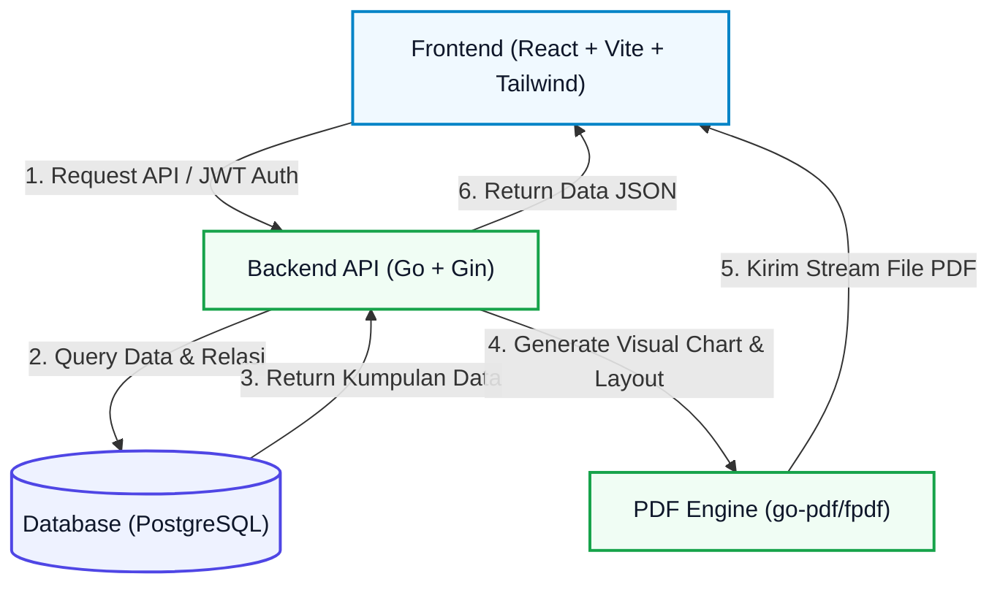
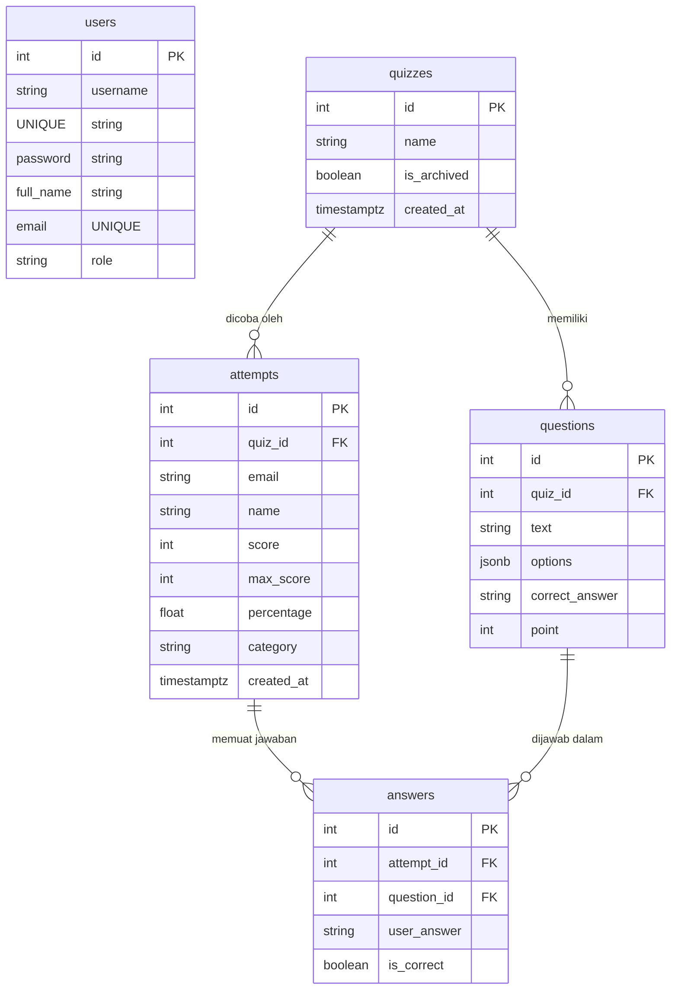

# Technical Test Quiz Application

Selamat datang di Tech-QuizApp. Ini adalah platform kuis interaktif yang dirancang untuk memudahkan evaluasi kompetensi, baik dari sisi pengajar (Admin) maupun peserta tes (User). Aplikasi ini mengintegrasikan sistem backend berbasis Golang dengan antarmuka pengguna berbasis React.js.

Aplikasi ini mencakup sistem manajemen kuis, visualisasi performa, analisis rekomendasi belajar, serta pencetakan laporan evaluasi berformat PDF langsung dari server.

---

## Diagram Arsitektur Aplikasi



---

## 1. Product Thinking

### Siapa Pengguna Produk Ini?
Aplikasi ini dirancang dengan membagi akses menjadi dua peran utama:

1. **Peserta Ujian / Siswa (User)**
   * **Profil**: Siswa, mahasiswa, atau peserta umum yang ingin menguji pemahaman materi mereka.
   * **Kebutuhan**: Membutuhkan halaman pengerjaan kuis yang sederhana, waktu pengerjaan yang jelas, tampilan skor setelah selesai, rincian jawaban yang salah/benar, serta opsi mengunduh laporan nilai untuk dokumentasi pribadi.
   
2. **Pengajar / Administrator (Admin)**
   * **Profil**: Guru, dosen, pembuat soal, atau staf administrasi.
   * **Kebutuhan**: Membutuhkan dasbor statistik untuk melihat tingkat partisipasi, kemampuan mengelola kuis dan soal (tambah, edit, hapus, arsip), serta memantau semua riwayat pengerjaan tes oleh siswa tanpa risiko kehilangan data.

---

### Masalah yang Diselesaikan
Platform ini dikembangkan untuk mengatasi beberapa kendala berikut:

* **Efisiensi Koreksi Ujian**: Penilaian ujian secara manual memakan waktu. Dengan aplikasi ini, jawaban langsung dievaluasi oleh sistem begitu dikirimkan (submit), sehingga mempercepat perolehan hasil kuis.
* **Umpan Balik Evaluasi (Feedback)**: Siswa sering kali hanya menerima nilai angka tanpa memahami letak kesalahannya. Aplikasi ini menyediakan rincian jawaban serta analisis tingkat kemahiran belajar (Beginner, Intermediate, Advanced) dan rekomendasi belajar sederhana berdasarkan soal yang dijawab salah.
* **Portabilitas Laporan**: Kebutuhan dokumen fisik untuk bukti pengerjaan diakomodasi melalui fitur ekspor ke PDF. Berkas PDF yang diunduh menyajikan data peserta, rincian skor, status jawaban, dan grafik pencapaian nilai per nomor soal secara rapi.
* **Pengarsipan Soal Tanpa Menghapus Riwayat**: Saat kuis tidak lagi aktif, pengajar sering kali terpaksa menghapusnya, yang berakibat pada hilangnya data riwayat pengerjaan peserta sebelumnya. Fitur pengarsipan (Archive) memungkinkan kuis dinonaktifkan dari halaman siswa, sementara data hasil pengerjaan terdahulu tetap tersimpan aman di database.

---

## 2. Dokumentasi Teknis dan Arsitektur

Platform ini memisahkan bagian Frontend dan Backend secara penuh (decoupled) untuk mempermudah pemeliharaan kode dan alur kerja tim.

### Model Hubungan Database (ERD Sederhana)
Hubungan antar-tabel dalam database PostgreSQL dikonfigurasi melalui berkas [postgres.go](file:///Users/mac/Music/tech-iqbal/backend/db/postgres.go):



---

### Alasan Memilih Tech Stack yang Digunakan

#### **Backend (Sisi Server)**
1. **Golang (Go v1.26+)**
   * *Alasan*: Menawarkan performa eksekusi kode yang efisien, waktu startup server yang cepat, serta konsumsi memori (RAM) yang relatif rendah dibandingkan beberapa bahasa pemrograman backend lainnya.
2. **Gin Web Framework** ([main.go](file:///Users/mac/Music/tech-iqbal/backend/main.go))
   * *Alasan*: Memiliki sistem routing yang stabil, performa ringan, dan dilengkapi dengan manajemen middleware serta pemetaan JSON bawaan yang mempermudah proses pembuatan API.
3. **PostgreSQL Database** ([postgres.go](file:///Users/mac/Music/tech-iqbal/backend/db/postgres.go))
   * *Alasan*: Database relasional yang kuat untuk menjaga integritas data hubungan antar-tabel. Fitur kolom data `JSONB` digunakan untuk menyimpan opsi pilihan ganda pada soal kuis tanpa memerlukan tabel tambahan.
4. **go-pdf/fpdf** ([pdf.go](file:///Users/mac/Music/tech-iqbal/backend/handlers/pdf.go))
   * *Alasan*: Memungkinkan perenderan dokumen PDF langsung dari backend dengan kontrol tata letak yang konsisten tanpa memerlukan tools tambahan pihak ketiga di server.
5. **JWT (JSON Web Token)** ([auth_middleware.go](file:///Users/mac/Music/tech-iqbal/backend/middleware/auth_middleware.go))
   * *Alasan*: Metode otentikasi stateless yang aman, di mana server hanya perlu memverifikasi token tanpa harus menyimpan data sesi aktif di RAM server.

#### **Frontend (Sisi Pengguna)**
1. **React.js (v19)** ([App.jsx](file:///Users/mac/Music/tech-iqbal/frontend/src/App.jsx))
   * *Alasan*: Memudahkan pembuatan antarmuka modular berbasis komponen, serta memiliki reaktivitas state untuk pembaruan UI yang dinamis.
2. **Vite** ([package.json](file:///Users/mac/Music/tech-iqbal/frontend/package.json))
   * *Alasan*: Build tool modern dengan Hot Module Replacement (HMR) yang sangat responsif selama masa pengembangan aplikasi dibandingkan build tools konvensional.
3. **Tailwind CSS** ([index.css](file:///Users/mac/Music/tech-iqbal/frontend/src/index.css))
   * *Alasan*: Mempercepat proses penataan gaya elemen HTML secara langsung melalui utilitas kelas CSS, menghasilkan desain responsif yang konsisten untuk berbagai resolusi layar.
4. **Chart.js & react-chartjs-2** ([AdminDashboard.jsx](file:///Users/mac/Music/tech-iqbal/frontend/src/pages/AdminDashboard.jsx))
   * *Alasan*: Library charting berbasis canvas HTML5 yang ringan untuk memvisualisasikan grafik statistik pada halaman admin secara interaktif.

---

## 3. Cara Menjalankan Aplikasi Secara Lokal dan Konfigurasi Environment

Pengaturan berkas `.env` sangat penting dan wajib diinformasikan dalam akses penggunaan. Tanpa pengaturan variabel lingkungan ini, backend tidak akan dapat terhubung ke PostgreSQL (menyebabkan server gagal berjalan) dan jalur komunikasi CORS antara frontend dan backend akan terputus.

Ikuti langkah-langkah berikut untuk memulai instalasi dan menjalankan aplikasi:

### Prasyarat Sistem
* **Go** (minimal versi 1.20+)
* **Node.js** (minimal versi 18+) & **npm**
* **PostgreSQL** yang berjalan aktif di komputer lokal Anda.

---

### A. Langkah Menjalankan Backend (Server Go)

1. Masuk ke direktori backend:
   ```bash
   cd backend
   ```
2. Buat sebuah berkas bernama `.env` di dalam direktori `backend` tersebut:
   ```bash
   touch .env
   ```
3. Salin dan sesuaikan isi berkas `.env` dengan konfigurasi database PostgreSQL lokal Anda:
   ```env
   DB_HOST=localhost
   DB_PORT=5432
   DB_USER=postgres
   DB_PASSWORD=""
   DB_NAME=backend_db
   PORT=8080
   JWT_SECRET=supersecretkey123
   FRONTEND_URL=http://localhost:5173
   ```
   > **Catatan Database**: Pastikan Anda telah membuat database kosong bernama `backend_db` di PostgreSQL Anda sebelum menjalankan server backend. Anda dapat membuatnya melalui terminal PostgreSQL atau aplikasi GUI seperti pgAdmin/DBeaver.

4. Jalankan server backend Go:
   ```bash
   go run main.go
   ```
   *Saat pertama kali dijalankan, sistem backend akan:*
   * Menghubungkan ke PostgreSQL sesuai konfigurasi `.env`.
   * Melakukan migrasi database secara otomatis untuk membuat tabel-tabel yang diperlukan ([postgres.go](file:///Users/mac/Music/tech-iqbal/backend/db/postgres.go)).
   * Memasukkan data awal (Auto-Seed) berupa 5 kuis default dan akun pengguna bawaan ([seed.go](file:///Users/mac/Music/tech-iqbal/backend/db/seed.go)).

   * **Akun Bawaan Hasil Seeding:**
     * **Admin**: Username: `admin` | Password: `admin123` | Email: `admin@gmail.com`
     * **User Biasa**: Username: `user` | Password: `user123` | Email: `user@gmail.com`

---

### B. Langkah Menjalankan Frontend (Aplikasi React)

1. Buka terminal baru dan masuk ke direktori frontend:
   ```bash
   cd frontend
   ```
2. Pasang semua dependensi modul Node.js yang dibutuhkan:
   ```bash
   npm install
   ```
3. Konfigurasikan variabel alamat API. Secara default, aplikasi frontend akan mengarah ke `http://localhost:8080/api`. Jika Anda ingin memastikannya secara eksplisit, Anda bisa membuat berkas `.env` di direktori `frontend` dan menambahkan baris berikut:
   ```env
   VITE_API_URL=http://localhost:8080/api
   ```
4. Jalankan server lokal pengembangan frontend:
   ```bash
   npm run dev
   ```
5. Buka browser Anda dan akses alamat **`http://localhost:5173`**.
6. Anda dapat langsung masuk menggunakan akun admin (`admin`/`admin123`) untuk menguji fitur manajemen kuis, atau mendaftarkan akun baru untuk mencobanya sebagai peserta biasa.

---

## 4. Keterbatasan, Shortcut, dan Tradeoff yang Diambil

Dalam merancang aplikasi ini, beberapa tradeoff dan keputusan teknis diambil untuk mengoptimalkan efisiensi penulisan kode serta alur kerja aplikasi tanpa menurunkan fungsionalitas utama:

1. **Migrasi Database Manual Tertanam**:
   * *Keputusan*: Kami menggunakan kueri SQL tertulis langsung yang dijalankan secara prosedural dalam kode Go ([postgres.go](file:///Users/mac/Music/tech-iqbal/backend/db/postgres.go#L37-L98)) alih-alih menggunakan library migrasi eksternal.
   * *Tradeoff*: Sangat cepat untuk pengembangan awal dan mengurangi overhead pustaka luar. Namun, jika di masa depan terdapat perubahan skema database pada lingkungan produksi, pengembang harus menulis query `ALTER TABLE` manual secara hati-hati agar tidak mengganggu data yang sudah ada.

2. **Penyimpanan Token Otentikasi**:
   * *Shortcut*: Token JWT yang diterima setelah login berhasil disimpan di `localStorage` peramban ([api/index.js](file:///Users/mac/Music/tech-iqbal/frontend/src/api/index.js#L8)).
   * *Tradeoff*: Memudahkan penulisan kode di sisi frontend dan mempercepat proses integrasi otentikasi. Namun, penyimpanan di `localStorage` memiliki kerentanan keamanan yang lebih tinggi terhadap serangan XSS (Cross-Site Scripting) dibandingkan dengan penyimpanan berbasis HttpOnly Cookie.

3. **Pencegahan Penyalinan Kunci Jawaban (Cheat Prevention)**:
   * *Keputusan*: Pada endpoint pengambilan detail kuis ([quiz.go](file:///Users/mac/Music/tech-iqbal/backend/handlers/quiz.go#L93-L95)), backend akan mengosongkan nilai kunci jawaban (`q.CorrectAnswer = ""`) dari objek respons JSON yang dikirimkan ke pengguna non-admin.
   * *Tradeoff*: Langkah yang efektif untuk mencegah siswa yang paham teknologi menyontek dengan melihat kiriman data API pada menu browser DevTools. Evaluasi kebenaran jawaban sepenuhnya diserahkan ke server saat proses submit.

4. **Pencetakan PDF di Sisi Server (Server-Side PDF)**:
   * *Keputusan*: Proses pembuatan dan penyusunan tata letak dokumen laporan PDF dilakukan di backend menggunakan library `fpdf` ([pdf.go](file:///Users/mac/Music/tech-iqbal/backend/handlers/pdf.go)).
   * *Tradeoff*: Hasil akhir cetakan PDF dijamin konsisten dan rapi di semua perangkat, serta mencegah pemalsuan nilai di sisi client sebelum dicetak. Keterbatasannya adalah proses render PDF prosedural ini membutuhkan perhitungan tata letak posisi elemen (koordinat X dan Y) secara manual di kode program dan menambah beban kerja CPU server.

5. **Mekanisme Pengarsipan Kuis (Soft Archive)**:
   * *Keputusan*: Fitur arsip kuis hanya merubah nilai kolom status kuis menjadi `is_archived = true` ([quiz.go](file:///Users/mac/Music/tech-iqbal/backend/handlers/quiz.go#L48-L57)) tanpa menghapus baris kuis dari database.
   * *Tradeoff*: Riwayat pengerjaan siswa atas kuis yang bersangkutan tetap utuh dan tersimpan di database untuk keperluan pelaporan admin, namun kuis tersebut tidak akan ditampilkan lagi kepada siswa biasa di daftar kuis aktif.

---

## 5. Fitur Utama Aplikasi

Sistem kuis ini memiliki fungsionalitas yang telah diuji dan berjalan dengan baik:

### Fitur Pengguna (Siswa):
* **Registrasi & Login**: Keamanan kata sandi menggunakan enkripsi bcrypt yang aman.
* **Daftar Kuis Terbuka**: Menampilkan daftar kuis yang aktif beserta jumlah pertanyaan di dalamnya.
* **Halaman Ujian**: Tampilan kartu soal yang responsif, navigasi antar-soal yang jelas, dan pengiriman jawaban yang terstruktur.
* **Skor & Penilaian**: Umpan balik skor berupa persentase nilai akhir, jumlah jawaban benar/salah, serta klasifikasi tingkat kompetensi.
* **Rekomendasi Belajar (Insights)**: Ringkasan hasil tes dalam bahasa Indonesia untuk memandu evaluasi mandiri peserta.
* **Ekspor PDF Laporan**: Fitur cetak laporan ujian berpenampilan bersih, lengkap dengan data diri, rincian jawaban benar/salah per nomor, serta visualisasi grafik batang poin per soal yang digambar secara dinamis dari server.
* **Riwayat Ujian**: Halaman khusus untuk meninjau kembali kuis-kuis yang telah dikerjakan sebelumnya beserta akses cepat untuk mengunduh ulang laporan PDF kapan saja.

### Fitur Pengelola (Admin Dashboard):
* **Dasbor Statistik**: Tampilan ringkasan total kuis, total siswa, dan total upaya ujian yang telah berlangsung.
* **Grafik Analitik**: Integrasi grafik tren evaluasi peserta.
* **Manajemen Kuis (CRUD & Arsip)**:
  * Membuat kuis baru dan merubah nama kuis.
  * Mengarsipkan kuis (Archive/Unarchive) untuk menonaktifkannya tanpa merusak data riwayat siswa.
  * Menghapus kuis beserta seluruh soal di dalamnya secara otomatis menggunakan fungsi cascade.
* **Manajemen Soal (CRUD Soal)**:
  * Menambahkan pertanyaan baru dengan bobot poin kustom dan opsi jawaban dinamis.
  * Mengedit teks pertanyaan, opsi, kunci jawaban, atau poin soal secara instan.
* **Monitoring Hasil (All Attempts)**: Halaman khusus admin untuk memantau data hasil pengerjaan kuis dari seluruh siswa di dalam sistem secara real-time.
* **Daftar Pengguna**: Daftar semua pengguna terdaftar berserta detail perannya di dalam aplikasi.

---

## Tautan Berkas Kode Utama

* **Pusat Konfigurasi Server & Route**: [main.go](file:///Users/mac/Music/tech-iqbal/backend/main.go)
* **Pusat Kueri Database**: [postgres.go](file:///Users/mac/Music/tech-iqbal/backend/db/postgres.go)
* **Algoritma Auto-Seed Data**: [seed.go](file:///Users/mac/Music/tech-iqbal/backend/db/seed.go)
* **Evaluasi & Penilaian Ujian**: [submit.go](file:///Users/mac/Music/tech-iqbal/backend/handlers/submit.go)
* **Perender Dokumen PDF**: [pdf.go](file:///Users/mac/Music/tech-iqbal/backend/handlers/pdf.go)
* **Klien Integrasi API Frontend**: [api/index.js](file:///Users/mac/Music/tech-iqbal/frontend/src/api/index.js)
* **Pengaman Rute Klien (Guard)**: [RouteGuard.jsx](file:///Users/mac/Music/tech-iqbal/frontend/src/components/RouteGuard.jsx)
* **Halaman Dashboard Admin**: [AdminDashboard.jsx](file:///Users/mac/Music/tech-iqbal/frontend/src/pages/AdminDashboard.jsx)
